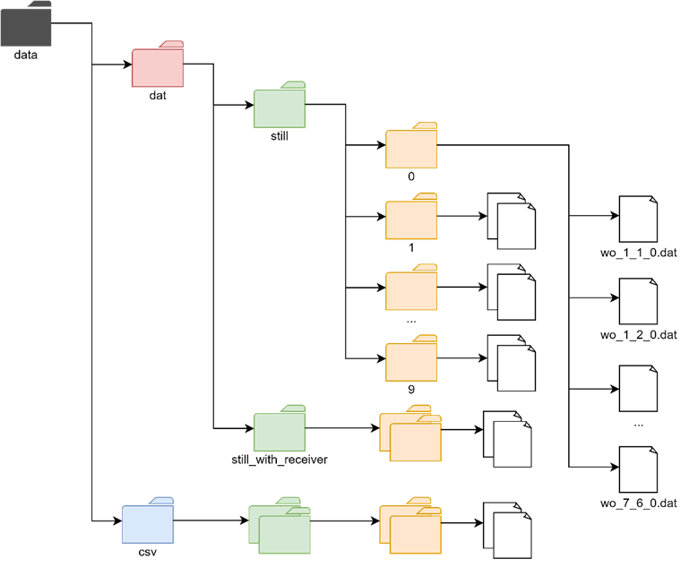
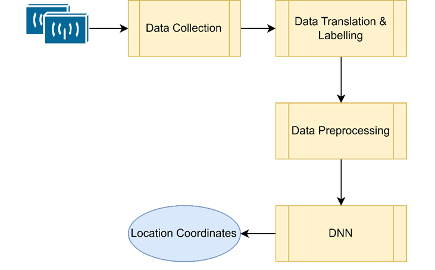
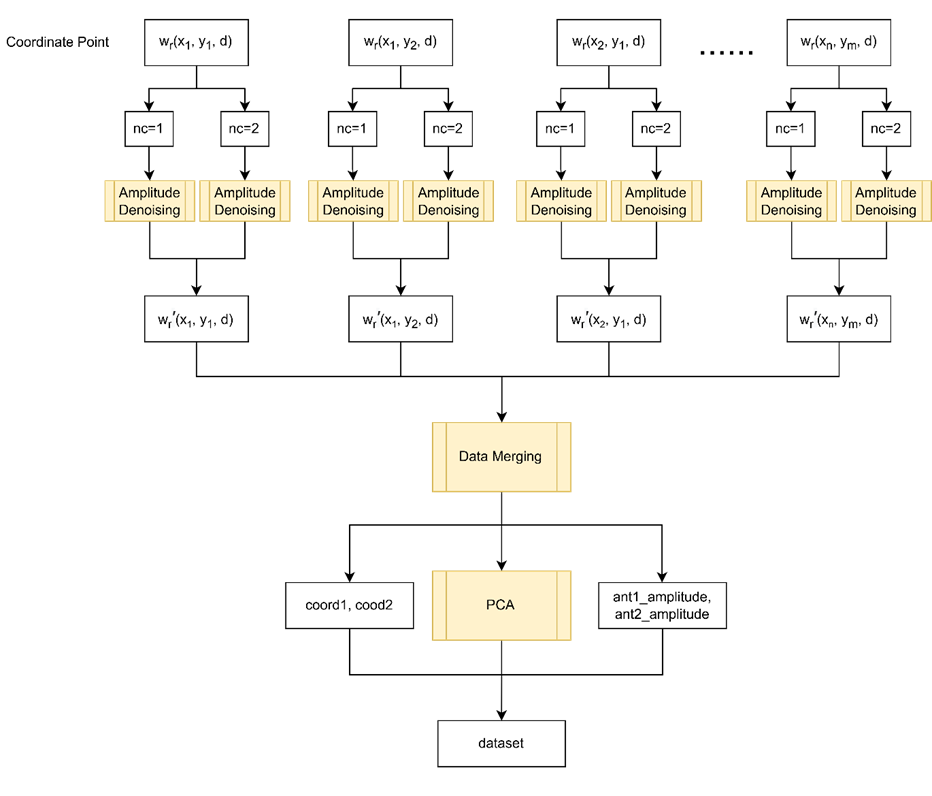

# Indoor Device-Free Wi-Fi Localization with Deep Neural Network

## Overview
This project focuses on enhancing indoor device-free localization using Wi-Fi Channel State Information (CSI) and Deep Neural Networks (DNNs). The approach aims to utilize the existing Wi-Fi infrastructure to accurately predict the location of individuals or objects in indoor environments without requiring additional hardware or wearable devices.

## Data
| **Variable Name**     | **Description**                                                                 |
|------------------------|---------------------------------------------------------------------------------|
| timestamp             | The UNIX timestamp recorded at the time when the packet is received.           |
| csi_len               | The length of the CSI data.                                                    |
| channel               | The Wi-Fi channel used during data collection.                                 |
| err_info              | Error information during data transmission.                                    |
| noise_floor           | Measured noise level on the channel.                                           |
| rate                  | Data transmission rate in Mbps.                                                |
| bandWidth             | Bandwidth used for the transmission.                                           |
| num_tones             | The number of tones (subcarriers) used in the CSI data.                        |
| nr                    | The number of receiving antennas used.                                         |
| nc                    | The number of transmitting antennas used.                                      |
| rssi                  | Received Signal Strength Indicator (RSSI) value on antenna 1.                 |
| rssi1                 | RSSI value on antenna 2.                                                      |
| rssi2                 | RSSI value on antenna 3.                                                      |
| rssi3                 | RSSI value on antenna 4.                                                      |
| payload_length        | The length of the payload in bytes.                                            |
| block_length          | The length of the data block.                                                  |
| subcarriers           | The index of the subcarrier.                                                   |
| ant1_amplitude        | The amplitude of the signal that was received by antenna 1.                    |
| ant2_amplitude        | The amplitude of the signal that was received by antenna 2.                    |
| ant1_phase            | The phase of the signal that was received by antenna 1.                        |
| ant2_phase            | The phase of the signal that was received by antenna 2.                        |
| with_receiver         | Indicates whether the data is collected with the receiver being carried.       |
| coord1                | Coordinate 1 or x.                                                             |
| coord2                | Coordinate 2 or y.                                                             |

## File Structure of Data

## Project Structure
The design of this project is divided into four main stages:
1. **Data Collection**
2. **Data Translation and Labeling**
3. **Data Preprocessing**
4. **Neural Network Model Training**

### 1. Data Collection
- **Environment:** Data were collected in a controlled lab environment, structured with rows of desks, computers, and other objects to create a realistic indoor space.
- **Setup:** Two Wi-Fi-enabled devices were used, one as the sender and the other as the receiver. They were set up with the Atheros CSI Tool for transmission.
- **Scenarios:** Data were collected in two scenarios: 
  1. With a stationary receiver.
  2. With the receiver carried by the collector.
- **Rounds:** Data were gathered at 32 specific points, with ten collection rounds for robustness. Each data point generated a .DAT file, storing 1000 Wi-Fi packets captured using the Atheros CSI Tool.

### 2. Data Translation and Labeling
- csi2csv -> convert.m
- data_processing -> csv_combine_XXX.py
- **Conversion:** Raw CSI data collected in .DAT format were converted into .CSV format using custom MATLAB scripts.
- **Labeling:** Each data file was labeled with its corresponding coordinates and an indicator for whether the data was collected with or without the receiver being carried.

### 3. Data Preprocessing

- **Standardization:** Using Scikit-learn’s StandardScaler, features were standardized to improve model performance.
- **Amplitude Denoising:** Two methods were used to preprocess amplitude data:
  - **Method 1:** Applied Hierarchical Density-Based Spatial Clustering of Applications with Noise (HDBSCAN) to remove noise and identify clusters.
  - **Method 2:** Combined Savitzky-Golay filtering for noise smoothing with HDBSCAN for clustering, enhancing data clarity.
- **Dimensionality Reduction:** Principal Component Analysis (PCA) was used to reduce dimensionality and retain essential features for model input.

### 4. Neural Network Model Training
- **Architecture:** The DNN model consists of an input layer, four fully connected hidden layers (with 512, 1024, 512, and 1024 neurons), and an output layer predicting the x and y coordinates.
- **Activation Function:** ReLU activation is used for non-linearity in hidden layers.
- **Optimizer:** The Adam optimizer is employed for efficient training, with Mean Absolute Error (MAE) and a custom Euclidean Distance Loss as evaluation metrics.
- **Training Strategy:** The data is split into 60% training, 20% validation, and 20% testing sets. Early stopping and model checkpointing are implemented to optimize training and prevent overfitting.
- **Computational Setup:** Training was performed on a GPU to expedite computations, but the large dataset still led to long training times.

## Results Summary
- **Method 1:** Utilized only HDBSCAN, resulting in higher noise and lower accuracy metrics.
- **Method 2:** Combined Savitzky-Golay filtering with HDBSCAN, significantly reducing noise and improving accuracy.

| **Metric**                     | **Coordinate/Tolerance** | **Method 1** | **Method 2** | **Improvement**  |
|--------------------------------|--------------------------|--------------|--------------|------------------|
| **Euclidean Distance Loss**    | -                        | 1.5426       | 1.2378       | 19.75%           |
| **MAE**                        | coord1                   | 1.2094       | 0.8671       | 28.30%           |
|                                | coord2                   | 0.9364       | 0.7002       | 25.22%           |
|                                | Overall                  | 1.0729       | 0.7837       | 26.95%           |
| **Custom Accuracy**            | 1                        | 46.72%       | 58.43%       | 25.06%           |
|                                | 0.5                      | 28.47%       | 41.9%        | 47.17%           |
|                                | 0.1                      | 5.22%        | 14.3%        | 173.94%          |
| **Mean Euclidean Distance Error** | -                      | 1.6782       | 1.2378       | 26.24%           |

## Future Enhancements
For potential improvements, could try integrating the Angle of Arrival (AoA) approach with Deep Convolutional Neural Networks (DCNN) and exploring adaptive filtering methods for NC2 data.

## References
- Atheros CSI Tool: [Link](https://wands.sg/research/wifi/AtherosCSI/), specifically [Atheros-CSI-Tool-UserSpace-APP](https://github.com/xieyaxiongfly/Atheros-CSI-Tool-UserSpace-APP/tree/master)

## Acknowledgement
- The University of Sydney, Faculty of Engineering, School of Electrical and Computer Engineering
